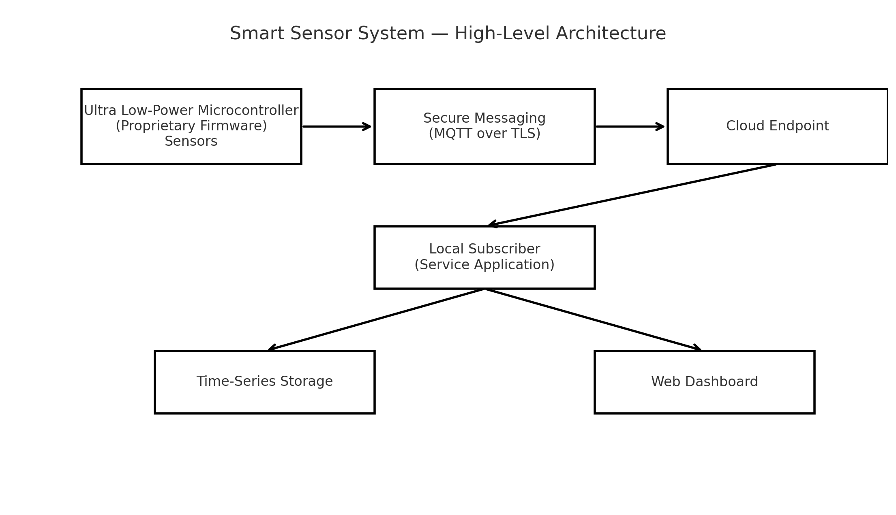
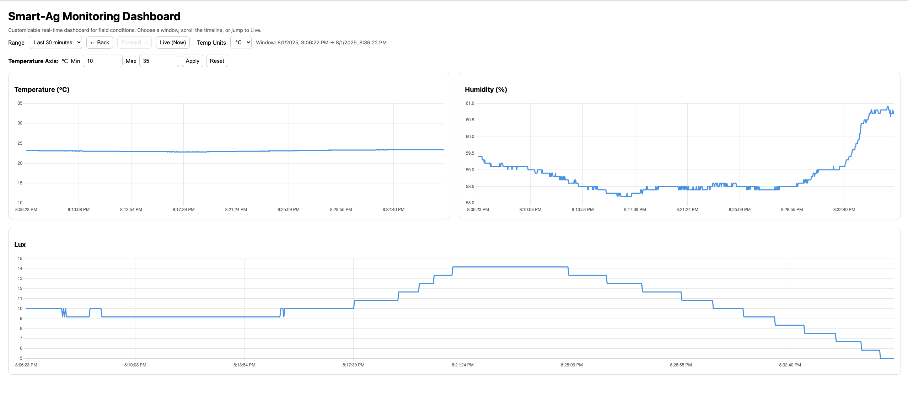

# Smart Sensor System – IoT Device to Cloud with Real-Time Dashboard

A demonstration of a **complete IoT workflow** from ultra low-power sensor hardware, through secure cloud messaging, to a live, interactive web-based dashboard.

> **Note:** This is a **demonstration portfolio** version of a production system developed by IoTegra Solutions. It omits proprietary implementation details, hardware specifics, and source code.

---

## 📦 System Overview

The system connects environmental sensors to a low-power microcontroller running proprietary firmware. Data is securely published using MQTT over TLS to a cloud endpoint, received by a local subscriber application, stored as time-series data, and visualized in a custom web dashboard.

---

## 🔹 Capabilities Demonstrated

- **Embedded Systems Development** for ultra low-power microcontrollers
- **Secure Communication** using MQTT over TLS with X.509 certificates
- **Sensor Integration** for environmental monitoring
- **Cloud-to-Local Data Flow** design and implementation
- **Custom Web Dashboard** for real-time visualization
- **Time-Series Data Storage** with efficient indexing
- **Deployment Automation** using containerized services

---

## 📊 Example Output

**Live Dashboard Screenshot**  

---

## 🚀 Development Process Highlights

1. **Hardware Integration** – Designed and configured sensor interfaces and power management for long battery life.
2. **Secure Messaging** – Implemented MQTT over TLS with mutual authentication using device certificates.
3. **Cloud Messaging Workflow** – Designed topic structures, message formats, and quality-of-service levels.
4. **Data Ingestion** – Developed a local subscriber service to receive and store sensor readings as time-series data.
5. **Visualization Layer** – Built a responsive web dashboard to display data trends over multiple time windows.
6. **Scalable Deployment** – Packaged services into portable deployment units for rapid installation.

---

## 📽 Demonstration Video

[▶ Watch Demo Video](docs/demo-video.mp4) *(or link to hosted version on Vimeo/YouTube)*

---

## 🔐 Security Notes

- This public repository contains **no functional source code**.
- Hardware models, firmware, and integration details are omitted.
- The diagrams and screenshots are representative only.

---

## 📜 License

Content © 2025 IoTegra Solutions. All rights reserved.  
This demonstration material is provided for portfolio purposes only and may not be used for production deployment.
